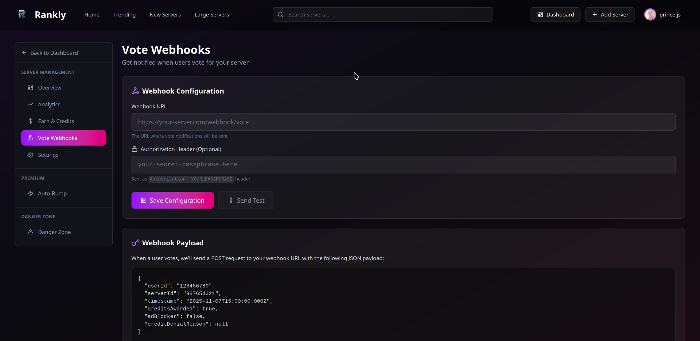
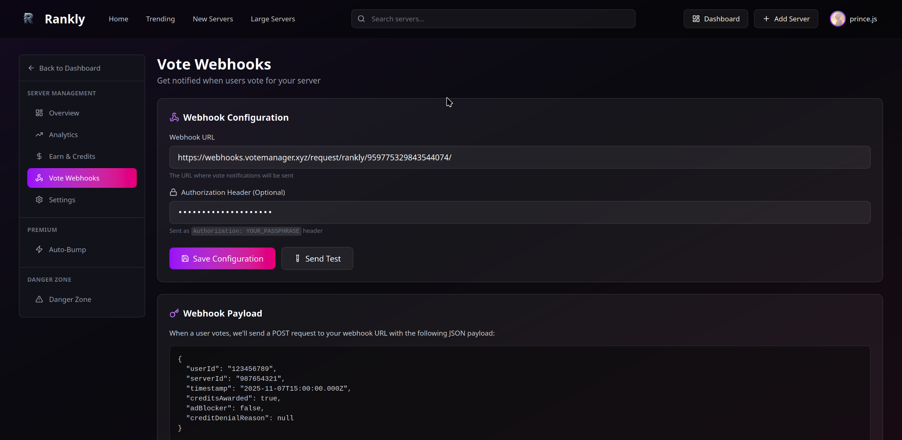
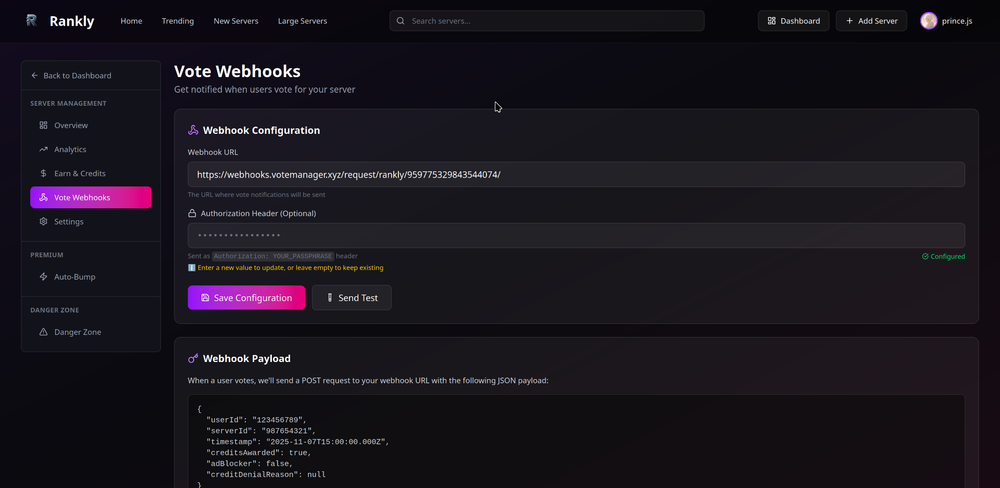

# Rankly


This continues from the tutorial on the previous page ([here](./))


To continue your setup, you'll need to navigate to your server's webhook settings on Rankly. The URL should look like this: `https://rankly.live/dashboard/[your-servers-id]/webhooks`

**E.G.** `https://rankly.live/dashboard/959775329843544074/webhooks`

<figure><figcaption>
Your server's webhook configuration page on Rankly
</figcaption></figure>

Once you're on the webhooks page, follow these steps:

1. Locate the **Webhook Settings** section on your dashboard
2. In the **Webhook URL** field, paste the URL provided in step two. The URL follows this format: `https://webhooks.votemanager.xyz/request/rankly/[your-servers-id]/`

**E.G.** `https://webhooks.votemanager.xyz/request/rankly/959775329843544074/`

3. Enter the provided passphrase into the **Authorization Header** field

<figure><figcaption>
Webhook configuration with filled details
</figcaption></figure>

Click the **Save Configuration** button to apply your settings.

<figure><figcaption>
Successfully saved webhook configuration
</figcaption></figure>


Congratulations! Your Vote Manager tracking is now set up for Rankly. When users vote for your server on Rankly, notifications will be sent to your configured Discord channel with the customized embed.


## Lost Your Passphrase?

If you need to retrieve your passphrase, you can use the `/trackers passphrase` command in Discord:
1. Select **Server** as the type
2. Choose your Rankly tracker from the options
3. Execute the command

<figure><figcaption>
Using the Trackers Passphrase Command
</figcaption></figure>


Remember to keep your passphrase secure as it's used to verify webhook requests from Rankly.
